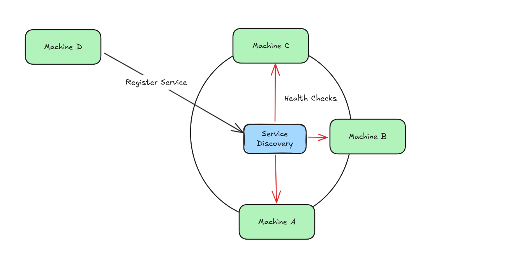
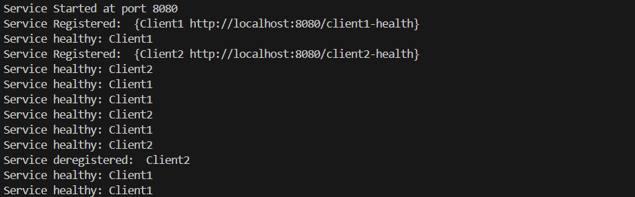

## Service Discovery

The demostration of the service discovery in go.
The repository contains the register, deregister, discover by name and discover all endpoints to integrate services to the service discovery server.

```
http://<service-discovery>:8080/register
http://<service-discovery>:8080/deregister?name=<service-name>
http://<service-discovery>:8080/discover?name=<service-name>
http://<service-discovery>:8080/discoverall
```



The repository contains the clients project which demostrates and helps in validating the health check and the endpoints are used to validate if the services are available every 10 seconds.

The in memory cache is used to save the services which can be replaced with cache server.



Use Docker to Build and Run the System

```
docker build -t service-discovery .
docker run -p 8080:8080 service-discovery
```